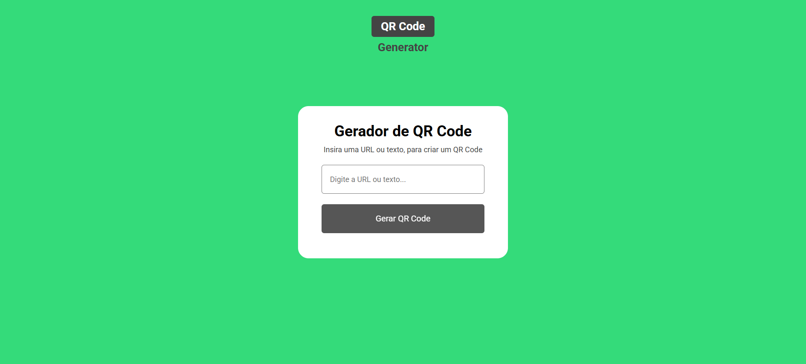
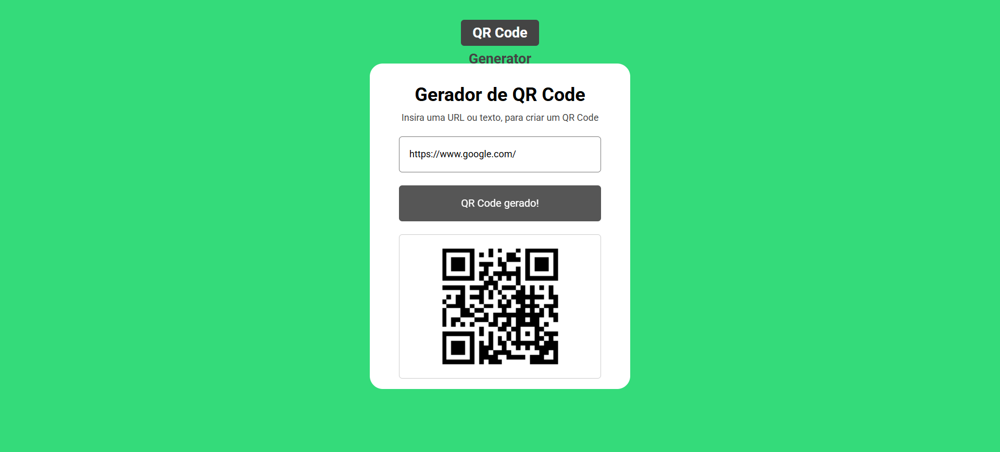

# Gerador de QR Code

> Um gerador de QR Code simples, rápido e gratuito, disponível em:  
> [https://gerador-de-qr-code-mauve.vercel.app/](https://gerador-de-qr-code-mauve.vercel.app/)

---

## 🚀 Funcionalidades

- Gera QR Codes personalizados a partir de texto, links ou qualquer conteúdo desejado
- Interface simples e responsiva (mobile e desktop)
- [Opcional: outros recursos, como escolha de cor ou tema, se houver]

---

## 🛠 Tecnologias

- HTML5
- CSS3
- JavaScript
- Deploy com [Vercel](https://vercel.com/)

---

## 💻 Como usar

1. Acesse: [https://gerador-de-qr-code-mauve.vercel.app/](https://gerador-de-qr-code-mauve.vercel.app/)
2. Digite ou cole o texto/link no campo indicado
3. O QR Code é gerado automaticamente!
4. Baixe o QR Code clicando em "Download"

---

## 📦 Como rodar localmente

git clone https://github.com/Feliipevasconcellos/Gerador-de-QR-Code.git

---

## 📷 Exemplo

